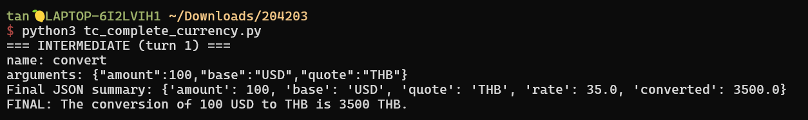
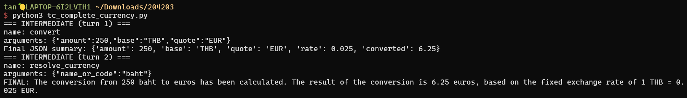
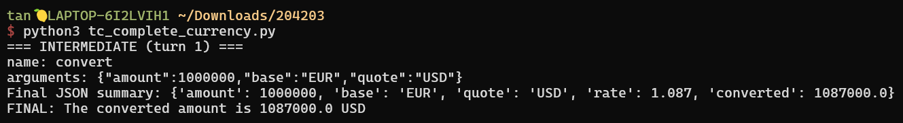
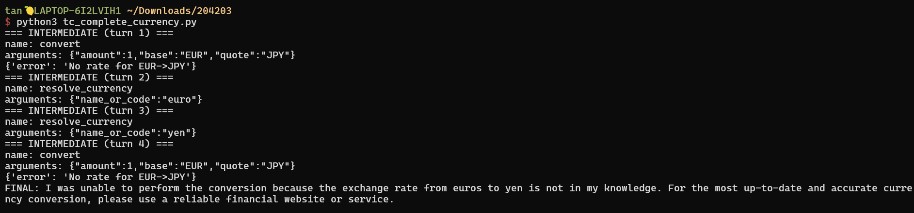
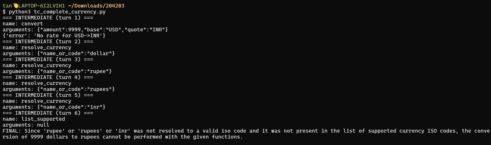

# hw10
## json_mode_schema; Results
messages = [
  {"role":"system","content":"Return ONLY a JSON object matching the schema."},
  {"role":"user","content":"Order A-1029 by Sarah Johnson : WB-500; 2x Water Bottle ($12.50 each), CP-010; 1x Carrying Pouch ($5). Total $30. sj@example.com. "}
]
## tc_complete_currency; Test cases and Results
ex.run("Convert 100 USD to THB")

ex.run("Convert 250 baht to euros")

ex.run("Convert 1000000 EUR to USD")

ex.run("Convert 1 euros to yens")

ex.run("Convert 9999 dollars to rupees")

